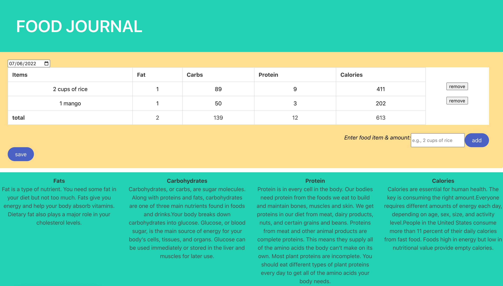

# Food Journal 🍎🗓

An interactive food journal to help you keep track of what you eat. Just enter the name and amount of a food item you've eaten, and the application will lookup its nutritional profile to display the fat, carbohydrate, and protein content. Entries in the journal can be saved to client-side storage, and entries from past days can be viewed by selecting a past date. Oh, and you can generate a random joke by clicking the button at the bottom of the page (because who doesn't appeciate a little humor).

The application can be accessed [here](https://nealmm.github.io/Project1).

## Technologies used

The application is styled using [Bulma](https://bulma.io), while the journal is able to lookup nutritional information by using the [Edamam Nutrition Analysis API](https://www.edamam.com), and our jokes are provided courtesy of [Spoonacular's API](https://spoonacular.com/food-api).

